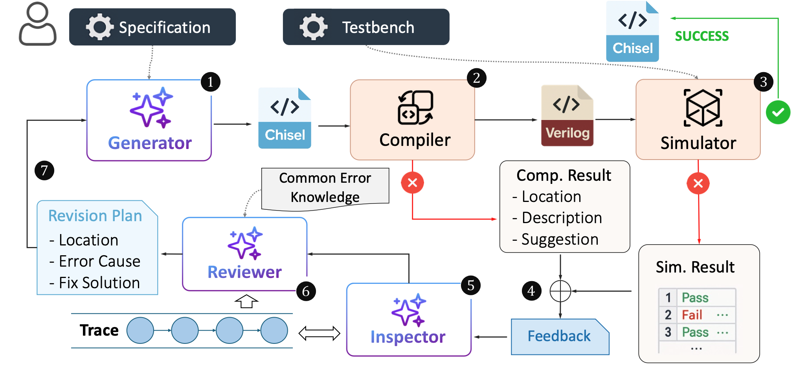

# ReChisel: Effective Automatic Chisel Code Generation by LLM with Reflection


This repository contains the implementation for the paper **"ReChisel: Effective Automatic Chisel Code Generation by LLM with Reflection"**, accepted at DAC 2025.

ReChisel is a system that enhances Large Language Models (LLMs) for hardware design by enabling them to automatically generate and verify Chisel code. The core of ReChisel is a **reflection mechanism**, where the LLM iteratively analyzes compilation and simulation feedback to correct its own code, significantly improving the success rate of generating functionally correct hardware designs.

- [arXiV] [2505.19734](https://arxiv.org/abs/2505.19734) 
- [DAC 2025 Presentation Slides](assets/slides.pdf)
- [DAC 2025 Poster](assets/poster.pdf)



## 📋 Contents
- [🏁 Getting Started](#-getting-started)
  - [Prerequisites](#prerequisites)
  - [Installation](#installation)
  - [Environment Variables](#environment-variables)
- [🚀 Quickstart: Using the ReChisel CLI](#-quickstart-using-the-rechisel-cli)
- [🎓 Interactive Tutorials (Jupyter Notebooks)](#-interactive-tutorials-jupyter-notebooks)
- [📝 Benchmark & Evaluation Details](#-benchmark--evaluation-details)
  - [Supported Benchmarks](#supported-benchmarks)
  - [Benchmark Specification Formatting](#benchmark-specification-formatting)
  - [Ensuring Verilog Compatibility](#ensuring-verilog-compatibility)
- [Citation](#citation)

## 🏁 Getting Started

### Prerequisites

Install Tools:

1.  **SBT (Simple Build Tool for Scala)**
    *   **Purpose:** Used to compile Chisel code into Verilog.
    *   **Website:** [scala-sbt.org](https://www.scala-sbt.org/)
    *   **Chisel Installation Guide:** [Chisel Docs: Installing with SBT](https://www.chisel-lang.org/docs/installation#sbt)
    *   *Note: This project is configured with `build.sbt` to manage Chisel dependencies.*

2.  **Icarus Verilog**
    *   **Purpose:** Used to compile and simulate the generated Verilog code for functional verification.
    *   **Website:** [steveicarus.github.io/iverilog/](https://steveicarus.github.io/iverilog/)

### Installation

```bash
git clone git@github.com:niujuxin/ReChisel.git
cd ReChisel
pip install -r requirements.txt
```

### Environment Variables

```bash
# For OpenAI API
export OPENAI_API_KEY="your_openai_api_key"

# For Claude AWS Bedrock
export AWS_ACCESS_KEY_ID="your_aws_access_key_id"
export AWS_SECRET_ACCESS_KEY="your_aws_secret_access_key"
```

## 🚀 Quickstart: Using the ReChisel CLI

The `rechisel_cli.py` script provides a complete, end-to-end pipeline for generating and verifying Chisel code from a natural language specification.


<details>
<summary><b>Click to see all CLI options</b></summary>

```bash
usage: rechisel_cli.py [-h] [--verbose] [-o OUTPUT] [-n NUM_ITERATIONS] [--prob-id PROB_ID]
                       --specification SPECIFICATION [--reference REFERENCE] --testbench TESTBENCH
                       [--top-module-name TOP_MODULE_NAME] --bm-type BM_TYPE
                       [--init-gen-system-prompt INIT_GEN_SYSTEM_PROMPT]
                       [--init-gen-model INIT_GEN_MODEL]
                       [--syntax-correction-system-prompt SYNTAX_CORRECTION_SYSTEM_PROMPT]
                       [--functionality-correction-system-prompt FUNCTIONALITY_CORRECTION_SYSTEM_PROMPT]
                       [--correction-model CORRECTION_MODEL]
                       [--sbt-reflection-system-prompt SBT_REFLECTION_SYSTEM_PROMPT]
                       [--iv-reflection-system-prompt IV_REFLECTION_SYSTEM_PROMPT]
                       [--functionality-reflection-system-prompt FUNCTIONALITY_REFLECTION_SYSTEM_PROMPT]
                       [--reviewer-model REVIEWER_MODEL] [--verifier-working-dir VERIFIER_WORKING_DIR]
                       [--use-in-context-history] [--use-llm-summary]
                       [--llm-summary-system-prompt LLM_SUMMARY_SYSTEM_PROMPT]
                       [--llm-summary-model LLM_SUMMARY_MODEL]
                       [--max-history-length MAX_HISTORY_LENGTH]

ReChisel CLI

options:
  -h, --help            show this help message and exit
  # ... and all other options
```

</details>


Below is an example of a ReChisel CLI command, using `benchmarks/VerilogEval_Prob030/` as an example:

```bash
python rechisel_cli.py \
--prob-id Prob030_popcount255 \
--specification benchmarks/VerilogEval_Prob030/Prob030_popcount255_spec.txt \
--reference benchmarks/VerilogEval_Prob030/Prob030_popcount255_ref.sv \
--testbench benchmarks/VerilogEval_Prob030/Prob030_popcount255_tb.sv \
--top-module-name TopModule \
--bm-type verilog-eval \
--use-in-context-history \
--use-llm-summary \
--verifier-working-dir output/VerilogEval_Prob030 \
--output output/VerilogEval_Prob030/result.json \
--verbose
```

This command will initiate the iterative generation and reflection process, with all intermediate procedures and the final result saved to the `output/VerilogEval_Prob030/result.json` path.
`sample_result_by_rechisel_cli.py` is the sample result of the above command. It shows the output produced by the ReChisel CLI.

## 🎓 Interactive Tutorials (Jupyter Notebooks)

We provide several Jupyter notebooks that break down the process step-by-step.

-   **`Main_code_gen_and_verify.ipynb`**
    *   Demonstrates the basic workflow: generating Chisel code from a specification and verifying its correctness, **without** the reflection mechanism.

-   **`Main_one_round.ipynb`**
    *   Illustrates a single round of reflection. Assuming an incorrect Chisel file and its verification report are available, this notebook shows how ReChisel analyzes the error and generates a corrected version. The `benchmarks/VerilogEval_Prob001` folder contains multiple `.scala` implementations, each with a different type of error. They are used to demonstrate how reflection can be applied to different kinds of errors.

-   **`Main_tracing.ipynb`**
    *   Explains the full multi-turn reflection process. This notebook demonstrates how ReChisel performs multiple iterations of generation and correction, and how it logs this history (tracing) to potentially use as in-context learning for the LLM.

## 📝 Benchmark & Evaluation Details

### Supported Benchmarks

We evaluate ReChisel on three public benchmarks. The `benchmarks/` directory only contains a few examples to demonstrate usage.

-   **VerilogEval (Spec-to-RTL):** [NVlabs/verilog-eval](https://github.com/NVlabs/verilog-eval/tree/main/dataset_spec-to-rtl)
-   **AutoChip (HDL-Bits):** [shailja-thakur/AutoChip](https://github.com/shailja-thakur/AutoChip/tree/main/verilogeval_prompts_tbs)
-   **RTLLM:** [hkust-zhiyao/RTLLM](https://github.com/hkust-zhiyao/RTLLM)

### Benchmark Specification Formatting

For the VerilogEval's Spec-to-RTL and RTLLM benchmarks, they are directly compatible with Chisel. However, for AutoChip's HDL-Bits, the original specifications are provided in `.v` files, where the module signatures (i.e., name, inputs, outputs, etc.) are implemented in Verilog, and the descriptions exist as comments within the code. This type of benchmark requires some processing within the code to make it compatible with Chisel.

We have converted all benchmark specifications into the same format as VerilogEval's Spec-to-RTL. The `benchmark/AutoChip_Vector5` directory contains an example of this conversion.

<details>
<summary><b>Example: Converting an AutoChip Specification</b></summary>

Here is an example of how a `.v` file from AutoChip is converted into a `.txt` specification.

**Original `Vector5_spec.v`:**
```verilog
 //Given five 1-bit signals (a, b, c, d, and e), compute all 25 pairwise one-bit comparisons
 // in the 25-bit output vector. The output should be 1 if the two bits being compared are equal.

// Hint: out[24] = ~a ^ a;   // a == a, so out[24] is always 1.
// out[23] = ~a ^ b;
// out[22] = ~a ^ c;
// ...

module top_module (
    input a, b, c, d, e,
    output [24:0] out );//

    // The output is XNOR of two vectors created by
    // concatenating and replicating the five inputs.
    // assign out = ~{ ... } ^ { ... };
    // Insert your code below

endmodule
```

**Converted `Vector5_spec.txt`:**
```text
I would like you to implement a module named `TopModule` with the following interface.
All input and output ports are one bit wide unless otherwise specified.

Module Name: `TopModule`
Ports:
  input a,
  input b,
  input c,
  input d,
  input e,
  output [24:0] out

Given five 1-bit signals (a, b, c, d, and e), compute all 25 pairwise one-bit comparisons in the 25-bit output vector.
The output should be 1 if the two bits being compared are equal.

Hint:
out[24] = ~a ^ a;   // a == a, so out[24] is always 1.
out[23] = ~a ^ b;
out[22] = ~a ^ c;
...
```
</details>


### Ensuring Verilog Compatibility


The SBT compiler compiles Chisel code into Verilog code. The Verilog code is then tested on the benchmark; if the Verilog code passes the tests, the Chisel code is considered correct. However, compiling Chisel code with the SBT compiler can lead to some compatibility issues.

1.  **No I/O Bundles:**
    *   **Problem:** Using a `Bundle` for I/O ports causes the Chisel compiler to add a prefix (e.g., `io_`) to all port names, breaking the testbench.
    *   **Solution:** We instruct the LLM to declare each I/O port individually using `IO(Input(...))` and `IO(Output(...))`.
    *   **Reference:** [Chisel Cookbook: How do I create I/O without a prefix?](https://www.chisel-lang.org/docs/cookbooks/cookbook#how-do-i-create-io-without-a-prefix)

2.  **Use `RawModule` instead of `Module`:**
    *   **Problem:** A standard Chisel `Module` automatically includes implicit `clock` and `reset` signals, which often conflicts with the testbench's port list.
    *   **Solution:** We require the LLM to use `extends RawModule`, which does not have implicit signals. For sequential logic, the clock and reset must be explicitly defined as inputs and used with `withClockAndReset(clock, reset) { ... }`.
    *   **Reference:** [Chisel Docs: RawModule](https://www.chisel-lang.org/docs/explanations/modules#rawmodule)

These constraints are embedded in the system prompts (`prompts/chisel_generation.txt` and `prompts/syntax_iv_reflection.txt`) to guide the LLM toward generating compatible code.

## Citation

```bibtex
@inproceedings{niu2025rechisel,
  author    = {Juxin, Niu and Xiangfeng, Liu and Dan, Niu and Xi, Wang and Zhe, Jiang and Nan, Guan},
  title     = {Rechisel: Effective Automatic Chisel Code Generation by LLM with Reflection},
  booktitle = {Proceedings of the 62nd ACM/IEEE Design Automation Conference (DAC)},
  year      = {2025}
}
```
